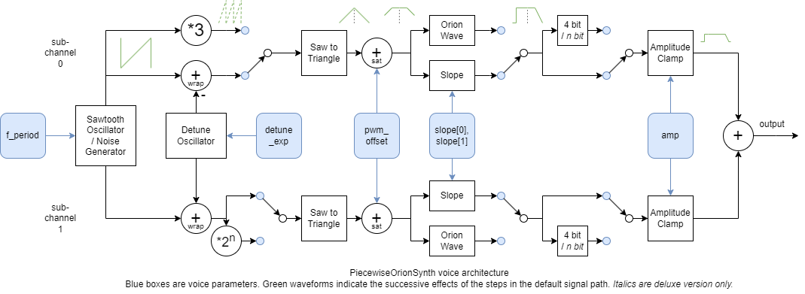

   

# PiecewiseOrionSynth

PiecewiseOrionSynth is a 4 channel synth that can create a superset of classic chiptune waveforms as well as some synthier sounds.
The synth uses mostly piecewise linear waveforms, and builds on many of the ideas of my Tiny Tapeout demo Orion Iron Ion (https://youtu.be/VCQJCVPyYjU) (it can more or less reproduce all of the sounds used in the demo, along with many others).

The synth exists in two versions:

- The peripheral version, as a TinyQV peripheral, participating in the Tiny Tapeout Crowd Sourced RISC-V competition (https://tinytapeout.com/competitions/risc-v-peripheral/)
- The deluxe version, as a standalone design with some additional features that didn't make it into the peripheral version due to space and time constraints.
  *Text that describes features unique to the deluxe version is marked in italics, unless they are in a dedicated section.*

The `main` branch of this repo contains the peripheral version, which is also in https://github.com/TinyTapeout/ttsky25a-tinyQV/tree/main/src/user_peripherals/pwl_synth and https://github.com/TinyTapeout/ttsky25a-tinyQVb/tree/main/src/user_peripherals/pwl_synth.
The `deluxe` branch of this repo contains the deluxe version.

Features:

- 4 channels
- 8 octaves: frequency range ~15 Hz to 3.9 kHz at 64 MHz clock frequency
- 1 MHz sample rate at 64 MHz clock frequency
- Waveforms include square / pulse / triangle / sawtooth-like waveforms
	- 3 parameters per channel that can be used to morph between these and other waveforms
	- Sweep rates for all parameters
	- Waveform slope can be varied to produce a similar effect as varying the cutoff frequency of a lowpass filter, changing the brightness of the sound
- Additional waveforms:
	- Noise (*includes linearly interpolated noise in the deluxe version*)
	- Orion Wave (a generalized version of the background sound in the [Orion Iron Ion](https://youtu.be/VCQJCVPyYjU?si=IOiYqYaK5zWj8HPi) demo)
- Volume per channel, with sweep rate and target value
- Frequency sweep per channel
- Option to quantize each channel to 4 bits / *1 - 7 bits* (can, e g, approximate the NES triangle wave).
- Hard/soft oscillator sync
- Stereo mode with five stereo positions per channel
- Each channel has two sub-channels that are added to the output, and can produce variations on the same waveform:
	- Detune function: Plays the waveforms at two slightly different pitches for added depth
	- Frequency multipliers: Options to multiply the oscillator frequencies for the two sub-channels with different multipliers
		(1x or 3x for first sub-channel, 1x / 2x / 4x / 8x for second) to produce octaves or thirds with a single channel
	- In stereo position mode, can output one sub channel left and one right (stereo voice), or mix both in both
- Common saturation function for channel 0:
	- In mono mode: Creates distortion between the two sub-channels (useful, e g, with `(3x, 2x)` and `(3x, 4x)` frequency multipliers for power chords)
	- In stereo mode: Creates distortion between channels 0 and 1
- 10 bit PWM output, formed by adding 7 bit outputs from the 8 sub-channels
- Designed to reduce / avoid quantization artifacts from limited PWM output resolution
	- Piecewise linear oscillator mode more or less eliminates quantization artifacts (and gives some color change)

[Read the documentation](docs/info.md)
