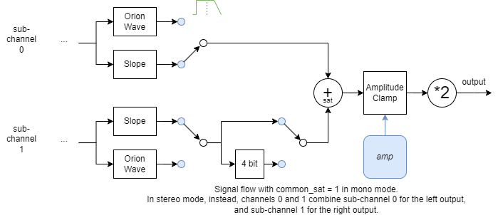

<!---

This file is used to generate your project datasheet. Please fill in the information below and delete any unused
sections.

The peripheral index is the number TinyQV will use to select your peripheral.  You will pick a free
slot when raising the pull request against the main TinyQV repository, and can fill this in then.  You
also need to set this value as the PERIPHERAL_NUM in your test script.

You can also include images in this folder and reference them in the markdown. Each image must be less than
512 kb in size, and the combined size of all images must be less than 1 MB.
-->

# PiecewiseOrionSynth

Author: Toivo Henningsson

Peripheral index: 33

## Overview

PiecewiseOrionSynth is a 4 channel synth that can create a superset of classic chiptune waveforms as well as some synthier sounds.
The synth uses mostly piecewise linear waveforms, and builds on many of the ideas of my Tiny Tapeout demo Orion Iron Ion (https://youtu.be/VCQJCVPyYjU) (it can more or less reproduce all of the sounds used in the demo, along with many others).

- 4 channels
- 8 octaves: frequency range ~15 Hz to 3.9 kHz at 64 MHz clock frequency
- 1 MHz sample rate at 64 MHz clock frequency
- Waveforms include square / pulse / triangle / sawtooth-like waveforms
	- 3 parameters per channel that can be used to morph between these and other waveforms
	- Sweep rates for all parameters
	- Waveform slope can be varied to produce a similar effect as varying the cutoff frequency of a lowpass filter, changing the brightness of the sound
- Additional waveforms:
	- Noise
	- Orion Wave (a generalized version of the background sound in the [Orion Iron Ion](https://youtu.be/VCQJCVPyYjU?si=IOiYqYaK5zWj8HPi) demo)
- Volume per channel, with sweep rate and target value
- Frequency sweep per channel
- Option to quantize each channel to 4 bits (can, e g, approximate the NES triangle wave)
- Hard/soft oscillator sync
- Stereo mode with five stereo positions per channel
- Each channel has two sub-channels that are added to the output, and can produce variations on the same waveform:
	- Detune function: Plays the waveforms at two slightly different pitches for added depth
	- Frequency multipliers: Options to multiply the oscillator frequencies for the two sub-channels with different multipliers
		(1x or 3x for first sub-channel, 1x / 2x / 4x / 8x for second) to produce octaves or thirds with a single channel
	- In stereo position mode, can output one sub channel left and one right (stereo voice), or mix both in both
- Common saturation function for channel 0:
	- In mono mode: Creates distortion between the two sub-channels (useful, e g, with `(3x, 2x)` and `(3x, 4x)` frequency multipliers for power chords)
	- In stereo mode: Creates distortion between channels 0 and 1
- 10 bit PWM output, formed by adding 7 bit outputs from the 8 sub-channels
- Designed to reduce / avoid quantization artifacts from limited PWM output resolution
	- Piecewise linear oscillator mode more or less eliminates quantization artifacts (and gives some color change)

## Table of contents

(See https://github.com/toivoh/ttsky25a-pwl-synth/blob/main/docs/info.md#toc for a version with clickable links.)

- [Overview](#overview)
- [Table of contents](#toc)
- [Register map](#regmap)
	- [Mode register fields](#mode_fields)
	- [Sweep register fields](#sweep_fields)
	- [Config register fields](#cfg_fields)
	- [Register differences between channels](#channel_differences)
- [IO pins](#io_pins)
- [Basic synth functions](#basic_functions)
	- [Setting the note frequency](#note_freq)
	- [Waveform shaping](#wf_shaping)
	- [Sweeping parameter values](#sweeping)
- [Additional synth functions](#additional_functions)
	- [Stereo mode](#stereo_mode)
	- [Frequency multipliers](#freq_mults)
	- [Common saturation](#common_sat)
	- [4 bit mode](#4bit_mode)
	- [Orion Wave](#orion_wave)
	- [Sample playback](#sample_output)
	- [Oscillator sync](#osc_sync)
	- [PWL oscillator](#pwl_osc)
- [Additional considerations](#additional_considerations)
	- [Avoiding audible clicks](#click_avoidance)
	- [Implementing envelopes](#envelopes)
	- [Low frequency notes](#low_freq_notes)
	- [The `counter` register](#oct_counter)
- [How it works](#how_it_works)
	- [ALU](#alu)
	- [Program](#program)
	- [Register file using latches](#regfile)
	- [Oscillators](#oscillators)
	- [Sigma-delta conversion](#sigma_delta)
	- [PWM output](#pwm_output)
	- [Stereo output](#stereo_output)
	- [Avoiding race conditions between internal and external register writes](#write_collision)
	- [Space saving hacks that depend on peripheral interface specifics](#space_hacks)
- [Tests used in development](#dev_tests)
- [How to test](#how_to_test)
- [External hardware](#ext_hw)

## Register map

All of the four channels have the same register layout, starting at offsets that are multiples of 16. There are also a few global registers (listed last):

| Address | Name             | Access | Description                     | Channel | Bit width |
|---------|------------------|--------|---------------------------------|---------|-----------|
| 0x00    | `f_period[0]`    | RW     | Period                          |       0 | 13        |
| 0x01    | `phase[0]`       | RW     | Phase                           |       0 | 12        |
| 0x02    | `amp[0]`         | RW     | Amplitude                       |       0 |  6        |
| 0x04    | `slope_r[0]`     | RW     | Rising slope                    |       0 |  8        |
| 0x06    | `slope_f[0]`     | RW     | Falling slope                   |       0 |  8        |
| 0x08    | `pwm_offset[0]`  | RW     | PWM offset                      |       0 |  8        |
| 0x0a    | `mode[0]`        | W      | Mode                            |       0 | 12        |
| 0x0c    | `sweep_pa[0]`    | W      | Sweep for period, amplitude     |       0 | 13        |
| 0x0e    | `sweep_ws[0]`    | W      | Sweep for PWM offset, slope     |       0 | 13        |
|         |                  |        |                                 |         |           |
| 0x10    | `f_period[1]`    | RW     | Period                          |       1 | 13        |
| 0x11    | `phase[1]`       | RW     | Phase                           |       1 | 12        |
| 0x12    | `amp[1]`         | RW     | Amplitude                       |       1 |  6        |
| 0x14    | `slope_r[1]`     | RW     | Rising slope                    |       1 |  8        |
| 0x16    | `slope_f[1]`     | RW     | Falling slope                   |       1 |  8        |
| 0x18    | `pwm_offset[1]`  | RW     | PWM offset                      |       1 |  8        |
| 0x1a    | `mode[1]`        | W      | Mode                            |       1 | 12        |
| 0x1c    | `sweep_pa[1]`    | W      | Sweep for period, amplitude     |       1 | 13        |
| 0x1e    | `sweep_ws[1]`    | W      | Sweep for PWM offset, slope     |       1 | 13        |
|         |                  |        |                                 |         |           |
| 0x20    | `f_period[2]`    | RW     | Period                          |       2 | 13        |
| 0x21    | `phase[2]`       | RW     | Phase                           |       2 | 12        |
| 0x22    | `amp[2]`         | RW     | Amplitude                       |       2 |  6        |
| 0x24    | `slope_r[2]`     | RW     | Rising slope                    |       2 |  8        |
| 0x26    | `slope_f[2]`     | RW     | Falling slope                   |       2 |  8        |
| 0x28    | `pwm_offset[2]`  | RW     | PWM offset                      |       2 |  8        |
| 0x2a    | `mode[2]`        | W      | Mode                            |       2 | 12        |
| 0x2c    | `sweep_pa[2]`    | W      | Sweep for period, amplitude     |       2 | 13        |
| 0x2e    | `sweep_ws[2]`    | W      | Sweep for PWM offset, slope     |       2 | 13        |
|         |                  |        |                                 |         |           |
| 0x30    | `f_period[3]`    | RW     | Period                          |       3 | 13        |
| 0x31    | `phase[3]`       | RW     | Phase                           |       3 | 12        |
| 0x32    | `amp[3]`         | RW     | Amplitude                       |       3 |  6        |
| 0x34    | `slope_r[3]`     | RW     | Rising slope                    |       3 |  8        |
| 0x36    | `slope_f[3]`     | RW     | Falling slope                   |       3 |  8        |
| 0x38    | `pwm_offset[3]`  | RW     | PWM offset                      |       3 |  8        |
| 0x3a    | `mode[3]`        | W      | Mode                            |       3 | 12        |
| 0x3c    | `sweep_pa[3]`    | W      | Sweep for period, amplitude     |       3 | 13        |
| 0x3e    | `sweep_ws[3]`    | W      | Sweep for PWM offset, slope     |       3 | 13        |
|         |                  |        |                                 |         |           |
| 0x03    | `counter[11:0]`  | RW     | Sample counter, lower half      |       - | 12        |
| 0x13    | `counter[23:12]` | RW     | Sample counter, upper half      |       - | 12        |
| 0x23    | `cfg`            | W      | Global configuration            |       - |  2        |

- All registers have zero initial values.
- All sizes of reads and writes (8/16/32 bits) are recognized by the synth, but will only access the register at the specified address.
	- 32 bit writes discard the upper 16 bits, while 32 bit reads return zeros in the upper 16 bits.
	- Avoid using 8 bit writes on registers that are bigger than 8 bits: the whole register will be written, but the values written to bits 8 and above are unspecified.
- All registers that can be updated by the synth itself are read/write, while registers that can only be updated by external writes are read only.

The synth operates in a loop, computing a new sample every clock 64 cycles. Reads can only be performed at a specific point at the end of each loop (reads of the sample counter are performed a few cycles earlier in the loop), so reads may be delayed by up to 64 clock cycles before they can start. A side effect is that a read of any register will synchronize the CPU to the synth's timing.

### Mode register fields
The layouts of the mode registers is

| 11             | 10:9       | 8     | 7            | 6:4                 | 3     |        2:0   |
|----------------|------------|-------|--------------|---------------------|-------|--------------|
| `detune_5th`   | `osc_sync` | `wf1` | `common_sat` | `freq_mults`        | `wf0` | `detune_exp` |
|                |            |       |              | / `stereo_pos`      |       |              |

The `waveform` field consists of the two bits `{wf1, wf0}`. The `waveform` and `osc_sync` fields affect the waveform and oscillators in different ways according to

| Field                  | Value | Description                      |
|------------------------|-------|----------------------------------|
| `waveform: {wf1, wf0}` | 0b00  | Normal oscillator (linear phase) |
|                        | 0b01  | Noise                            |
|                        | 0b10  | PWL oscillator                   |
|                        | 0b11  | Orion Wave                       |
|                        |       |                                  |
| `osc_sync`             | 0     | Sync off                         |
|                        | 1     | 4 bit mode (sync off)            |
|                        | 2     | Hard sync                        |
|                        | 3     | Soft sync                        |

### Sweep register fields
The sweep registers are laid out according to

| register       | bits:        12 |             11:8 | 7 |           6:4 |         3:0 |
|----------------|-----------------|------------------|---|---------------|-------------|
| `sweep_pa`     | `f_period`:     | `f_period`:      | X | `amp`:        | `amp`:      |
|                | sign            | rate             |   | target        | rate        |

| register       | bits:          12 |               11:8 | 7 |         6:5 |            4 |          3:0 |
|----------------|-------------------|--------------------|---|-------------|--------------|--------------|
| `sweep_ws`     | `pwm_offset`:     | `pwm_offset`:      | X | slopes:     | slopes:      | slopes:      |
|                | sign              | rate               |   | `dir`       | sign         | rate         |

### Config register fields
The `cfg` register controls the mono/stereo modes:

| register       | bits:       1 |         0 |
|----------------|---------------|-----------|
| `cfg`          | stereo_pos_en | stereo_en |

### Register differences between channels
The 4 channels work mostly the same, but some functionalities are only available for some of them, and the noise function has two versions:

| Channel            | LFSR (noise)    | `common_sat` | `osc_sync` | `detune_5th`   |
|--------------------|-----------------|--------------|------------|----------------|
| 0                  | 18 bit (shared) | yes          | yes        | yes            |
| 1                  | 11 bit          | no           | no         | no             |
| 2                  | 11 bit          | no           | no         | yes            |
| 3                  | 18 bit (shared) | no           | yes        | no             |

If a function is unsupported for a given channel, the channel behaves as if the corresponding mode bits are zero.

- The channels use two different kinds of noise generators:
	- Channels 0 and 3 use an 18 bit LFSR, producing a noise sequence that takes much longer to repeat than for the 11 bit LFSRs used by channels 1 and 2
	- Unless you want to hear the repetition, the 11 bit LFSRs should probably only be used for short periods at a time, at a low frequency, or maybe with a quickly changing frequency
	- The two 18 bit LFSRs share some of their state; results are unpredictable if both are used at the same time
- `common_sat` is only supported as a mode bit for channel 0, but in stereo mode, it will cause common saturation between channels 0 and 1
- `osc_sync` can make a channel's oscillator be affected by the previous channel's oscillator. The previous channel doesn't need to have `osc_sync` support for this to work.

## IO pins

The synth produces two output signals: `pwm_out_l` and `pwm_out_r`. These are PWM signals representing the synth's left and right outputs (pulse frequency = `fs`).
In mono mode, both signals are identical.
Every other output pin is assigned to `pwm_out_l` and `pwm_out_r`, starting at `uo_out[0] = pwm_out_l` and ending at `uo_out[7] = pwm_out_r`.
The input pins are not used.

## Basic synth functions

### Setting the note frequency

The frequency of each channel is set using a simple floating point format, with a 3 bit exponent to control the octave:

	f_period[12:0] = {period_exp[2:0], mantissa[9:0]}

where `period_exp = 7 - octave`.
The period in samples is given by

	period = 2^(period_exp - 2) * (1024 + mantissa)
	       = 2^(5 - octave) * (1024 + mantissa)

and goes from 256 samples for the highest note to 65504 samples for the lowest.

Octaves 0 - 5 each support 1024 distinct frequencies, while octave 6 is limited to 512 and octave 7 to 256.
When staying at a fixed frequency for the two highest octaves, set `mantissa[0] = 0` for `octave = 6` and `mantissa[1:0] = 0` for `octave = 1`.

The period increases linearly with `f_period` within each octave, but at a larger scale, the floating point format acts like a logarithmic scale.
The note frequency is then given by

	f = fs / (2^(period_exp - 2) * (1024 + mantissa))
	  = fs * 2^(octave - 5) / (1024 + mantissa)

where the sampling frequency

	fs = f_clk / 64

is `fs = 1 MHz` if the default max clock frequency of 64 MHz is used.
The note frequency range is then roughly 15 - 3900 Hz.

In noise mode, `f_period` controls the (average) sampling period of the noise instead:

	noise_sampling_period = 8 * 2^period_exp * (1024 + mantissa)/1024
	                      = 8 * 2^(7 - octave) * (1024 + mantissa)/1024

which gives a noise sampling period of 8 to 2047 samples.
At `fs = 1 MHz`, the range for the noise sampling frequency goes from 488 Hz to 125 kHz.

### Waveform shaping

The diagram above illustrates the workings of the synth voices in most cases (changes compared to this signal flow due to different options are noted in the description of the corresponding function)

- Each voice has two sub-channels with similar behavior (but different detuning / frequency multipliers)
- Normally, both sub-channel outputs are added to produce the channel's output

The positions of the switches indicate the default signal flow, which can be described from left to right as follows:

- The source for both sub-channels is the same sawtooth oscillator controlled by `f_period` (can also be used as a noise source)
- The detune oscillator can be used to pull the two sub-channel's frequencies apart slightly - this is the main difference between the sub-channels
- The phase value / sawtooth wave is converted into a triangle wave
	- The `pwm_offset` parameter can be used to offset the triangle wave, which will increase the duty cyle of the output signal
- The slope step can increase the slope of the the signal, with separate control of the rising and falling slopes using the  `slope_r` and `slope_f` parameters
	- Higher slopes cause brighter sounds
	- Different rising and and falling slopes cause different tone colors
- The signal is clamped based on the `amp` parameter to control the volume
- Finally, the sub-channel outputs are added into the synth's output signal

The `amp` parameter is used to control the volume.
The simple clamping behavior for `amp` avoids rounding artifacts, and also makes the waveform change as the amplitude is reduced, causing a shift in tone color. When `amp` becomes smaller, the slope has less and less influence on the waveform (the slope increases compared to the amplitude), while `pwm_offset` maintains its effect.

The rising slope `slope_r` is applied during the first half of the period, and the falling slope `slope_f` during the second half. If the slopes are different, and `pwm_offset` is big enough, and at least one of the slopes is small enough, there can be a discontinuity in the output waveform when switching from `slope_f` to `slope_r`. This should be avoided if smooth waveform is desired, but could of course be used to create certain effects.

A `slope` value of zero preserves the incoming signal as it is.
Every increase of `slope` by 16 doubles the actual slope. Between two doublings, increasing `slope` in small steps causes the waveform to morph between two straight slopes using a piecewise linear waveform that combines segments with both of the two endpoint slopes.
This adds some color variation to the sound as the slope is increased/decreased. Some steps from `slope = 0` to `slope = 16` are illustrated below:

The oscillators are always running, so when starting a new note, the phase might be at any value. If you want to control the starting phase, write to the corresponding `phase` register just before turning on the note. Note that when detuning is used, the actual phase used to create the waveform contains a detuning term as well, and the phases of the two sub-channels will likely not be the same due to this.

#### Detuning

Detuning is used to create a small frequency difference between the two sub-channels. When the two waveforms are added together, the resulting beating effect adds depth to the sound.
The delta frequency between the two sub-channels should be more or less proportional to the note frequecy being played.
The delta frequency for a channel can controlled using `detune_exp`. Each increase of `detune_exp` by one doubles the delta frequency, except that `detune_exp = 0` turns off detuning.

For channels that support it, setting `detune_5th = 1` can be used as an intermediate step between doublings, multiplying the delta frequency by 1.5.
(Except for the case when `detune_exp = 0, detune_5th = 1`, which has half the delta frequency of `detune_exp = 1, detune_5th = 0`).
The case `detune_exp = 7, detune_5th = 1` should mostly work as intended, but there will be an error in bit 0 of the 12 bit phase after detuning.

In the default signal flow, the delta frequency when `detune_exp > 0, detune_5th = 0` is given by

	delta_frequency = fs * 2^(detune_exp - 24)

which goes from around 0.12 Hz to 7.6 Hz as `detune_exp` goes from 1 to 7 (at a sampling frequency of `fs = 1 MHz`).

The relative delta frequency (relative to the note frequency) is

	delta_frequency / f
	  = 2^(detune_exp - 24) * (2^(period_exp - 2) * (1024 + mantissa))
	  = 2^(detune_exp - 24) * (2^(5 - octave) * (1024 + mantissa))
	  = 2^(detune_exp - octave) * (1024 + mantissa) * 2^-19
	  = 2^-8 * (1024 + mantissa)/2048 * 2^(detune_exp - octave)

Setting `detune_exp = octave` gives a relative delta frequency of `2^-9` to `2^-8`, depending on `mantissa`, or 3.4 to 6.7 cents difference in pitch between the two sub-channels, which shouldn't be excessive. At least the double (`detune_exp = min(7, octave + 1)`) should be useful as well. Lower detuning values can be used if less detuning is desired.

The effect of the `freq_mults` field on detuning is described further in the corresponding section below.
The general effect is that if it is turned on, no detuning is applied through sub-channel 0, halving the delta frequency so that `detune_exp` should be increased by one to achieve the same effect. The fundamental frequency is also changed, but in some cases the detuning is scaled to compensate.

#### Pseudocode for the channel waveform calculations
The pseudocode below is expressed in terms of rescaled register values

	pwm_offset_s = pwm_offset / 256  # range 0 - almost 1
	slope_s[i]   = slope[i] / 16     # range 0 - almost 16
	amp_s        = amp / 64          # range 0 - almost 1
	phase_s      = phase / 4096      # range 0 - almost 1

The calculations for the default signal path can be described according to the following steps:

	y = phase_s
	# y = sawtooth wave, 0 <= y <= 1

	# Detune. The waveform is calculated with detune_sign = -1
	# for sub-channel 0, and with detune_sign = +1 for sub-channel 1. 
	# If detune_5th=1, detune_sign = -2 is used for sub-channel 0 instead,
	# causing 1.5x as much detuning.
	if detune_exp != 0 or (sub_channel == 0 and detune_5th != 0):
		y = wrap(y + detune_sign * sample_counter * 2^(detune_exp - 25))
	# y = sawtooth wave, 0 <= y <= 1

	# Phase to triangle wave
	y = y * 2
	# Keep track of if we are on the rising (0) or falling edge (1)
	# of the waveform:
	part = 0
	if y >= 1:
		y = 2 - y
		part = 1
	# y = triangle wave, 0 <= y <= 1
	y = y * 2 - 1
	# y = triangle wave, -1 <= y <= 1

	# Pulse width modulation offset
	y = min(y + pwm_offset_s, 1)  # 0 <= pwm_offset_s < 1
	# y = triangle wave with DC offset, clamped to y <= 1

	# Increase slope, clamp to -1 <= y <= 1.
	## The slope value used depends on if we are
	## on the rising or falling edge of the waveform:
	slope_s = slope_f_s if part else slope_r_s
	## The slope update behaves approximately like
	## y = saturate(2^slope_s * y), but is piecewise linear.
	## Split the slope into integer and fractional parts:
	slope_int = floor(slope_s)
	slope_frac = slope_s - slope_int
	## Apply the integer slope:
	y = saturate(2^slope_int * y)
	## Apply the fractional slope,
	## slope_frac = 0 ==> no change, ... , slope_frac = 1 ==> y = 2y:
	y = saturate(clamp(2*y, -slope_frac/2, slope_frac/2))

	# Volume clamp
	y = clamp(y, -amp_s, amp_s)
	# y = output waveform, -1 <= y <= 1

### Sweeping parameter values

Sweep parameters can be used to make their corresponding parameters increase or decrease at a steady rate.
The basic setup is the same for all parameters, but the details are a bit different.

All sweep values have a 4 bit `rate` value. The swept parameter is increased or decreased by one step at a frequency given by

| `rate` | Frequency of parameter update |
|--------|-------------------------------|
| 0      | Never (off)                   |
| 1      | Maximum rate                  |
| 2 - 15 | Once every `2*2^rate` samples |

The maximum rate for the `f_period` parameter is once every 8 samples, while the maximum rate for the other parameters is once every 32 samples.
The maxiumem rate must be specified using `rate=1`. For `f_period`, the next lower rate (half as often) is given by `rate=3`, while for the other parameters, it is given by `rate=5`.

Most sweep parameters specify a sign: `0 = increase, 1 = decrease`. The parameter will sweep until the sweep is stopped by changing the sweep value, or the parameter is at its extreme value.
The amplitude sweep parameter includes a 3 bit `target` value instead, where the 6 bit target amplitude is given by `target_amplitude = {target, target} = 9*target`.
The amplitude will sweep up or down until it reaches the target amplitude and then stay.

The rising and falling slope values `slope_r` and `slope_f` share a common sweep value, with an additional 2 bit `dir` value that specifies how to apply the sweep:

| `dir` | Behavior                                                                  |
|-------|---------------------------------------------------------------------------|
| 2'b11 | Sweep both slopes                                                         |
| 2'b01 | Sweep `slope_r` only                                                      |
| 2'b10 | Sweep `slope_f` only                                                      |
| 2'b00 | Sweep both slopes in opposite directions, flipping the sign for `slope_f` |

## Additional synth functions
These functions alter the waveform calculations in the synth in various ways relative to the voice architecture diagram in the [waveform shaping](#wf_shaping) section.

### Stereo mode

Setting `stereo_en = 1` in the `cfg` register enables stereo mode. In this mode, the outputs of the two sub-channels of each channel are split so that sub-channel 0 contributes to the left output `pwm_out_l`, and sub-channel 1 contributes to the right output `pwm_out_r`.
Combined with detuning, this create a stereo voice for each channel, resulting in a stereo effect even when all voices are placed in the center (default).

The stereo position of each channel can be controlled by turning on `stereo_pos_en = 1` in the `cfg` register.
In this case, the `freq_mults` / `stereo_pos` field in the `mode` register sets the channel's stereo position: (while the frequency multipliers remain at their default (1x, 1x) value)

| `stereo_pos`      | Value | Position   | Stereo voice | Left amplitude | Right amplitude |
|-------------------|-------|------------|--------------|----------------|-----------------|
|                   | 0     | 0 (left)   | no           | 100%           |   0%            |
|                   | 1     | 1          | no           | 100%           |  50%            |
|                   | 2     | 2 (center) | no           | 100%           | 100%            |
|                   | 3     | 3          | no           |  50%           | 100%            |
|                   | 4     | 4 (right)  | no           |   0%           | 100%            |
|                   | 5     | 1          | yes          | 100%           |  50%            |
|                   | 6     | 2 (center) | yes          | 100%           | 100%            |
|                   | 7     | 3          | yes          |  50%           | 100%            |

For the cases where "Stereo voice: no" is specified above, both sub-channels alternate the sign of detuning every sample. This causes beating between the two detuned frequencies in the left and right outputs (as in the mono case), but looses the stereo voice effect. There is no option for "Stereo voice: yes" for the left (0) and right (4) positions, since the same effect can be achieved by disabling detuning (`detune_exp = detune_5th = 0`).

### Frequency multipliers

When `stereo_pos_en = 0`, the `freq_mults` / `stereo_pos` field in the `mode` register can be used to apply different frequency multipliers to the two sub-channels.
This can be used to play octaves / fifths / fourths using a single channel. The multipliers `(3x, 2x)` and `(3x, 4x)` represent a just intonation perfect fifth / fourth respectively (which is what can be easily calculated), with sub-channel 0 approximately 702 cents above / 498 cents below sub-channel 1, respectively.
Adding detuning will pull the interval towards and beyond the equal tempered perfect fifth / fourth at 700 cents above / 500 cents below.
Frequency multipliers are useful together with `common_sat = 1` to play distorted power chords or distorted detuned octaves, but can be used without it as well.

Sub-channel 0 can apply a 1x or 3x multiplier (controlled by `freq_mults[0]`), while sub-channel 1 can apply a 1x, 2x, 4x, or 8x multiplier (controlled by `freq_mults[2:1]`):

| `freq_mults`           | Value | (Sub-channel 0 multiplier, Sub-channel 1 multiplier) |
|------------------------|-------|------------------------------------------------------|
|                        | 0     | (1x, 1x) frequency                                   |
|                        | 1     | (3x, 1x) frequency                                   |
|                        | 2     | (1x, 2x) frequency                                   |
|                        | 3     | (3x, 2x) frequency                                   |
|                        | 4     | (1x, 4x) frequency                                   |
|                        | 5     | (3x, 4x) frequency                                   |
|                        | 6     | (1x, 8x) frequency                                   |
|                        | 7     | (3x, 8x) frequency                                   |

Sub-channel 0 is unaffacted by detuning in all cases except `(1x, 1x)`.
When `freq_mults[0] = 1` (3x mode) and `detune_5th = 1`, a 5x multiplier is used instead of the 3x multiplier, giving access to a just intonation major third (5x, 4x). (This was a bit of a spurious feature caused by how the `detune_5th` and 3x features are implemented.)
Since detuning is applied to sub-channel 1 before the frequency multiplier, the detuning frequency will scale with the sub-channel's frequency multiplier.

### Common saturation

When `common_sat = 1`, instead of applying amplitude clamping individually, the outputs of the two sub-channels for channel 0 are added together and saturated before contributing to the output. The signal is also multiplied by 2, since it replaces the output of two sub-channels.
In stereo mode, the same operation is applied within the two sub-channels but between channels 0 and 1, combining the outputs of channel 0 and 1 for sub-channel 0 and 1 separately.

This effect creates distortion between the combined signals. It is probably most useful when the frequency ratio between the two signals is close to (but not exactly) a simple integer ratio.
In the mono case, this ratio can be achieved with `freq_mults` plus detuning.
In the stereo case, the frequency ratio is of course controlled by setting frequencies for channels 0 and 1 individually. Detuning is still useful to make the left and right outputs differ, but will not affect the frequency ratio in the distortion effect.

### 4 bit mode

When `osc_sync = 1` in the `mode register`, the output of the slope step is quantized to 4 bits before going to the amplitude clamp step.
This can be used to imitate the triangle wave channel of the NES, which uses a 4 bit output. This adds some harmonics to the triangle wave, which is otherwise not very harmonically rich.
4 bit mode can of course also be used to add harmonics to other waveforms.

When used with common saturation, 4 bit quantization will not be applied to the first term in the saturating sum, only the second.

### Orion Wave

The Orion Wave is a family of piecewise constant, quite harmonically rich waveforms, with a few parameters to vary the waveform in more or less gradual ways.
The family includes close approximations to the waveforms used for the background loop in my Tiny Tapeout demo [Orion Iron Ion](https://youtu.be/VCQJCVPyYjU?si=IOiYqYaK5zWj8HPi).

In the synth, the Orion Wave implementation replaces the triangle and slope steps with the following computations:

	# Input: sawtooth wave, 12 bits (0 - 4095)
	y = phase

	# Don't transform the sawtooth to a triangle wave, but offset
	# in different directions  depending on if we are in the first
	# or second half of the cycle
	if y < 2048: y += (pwm_offset - 256) << 2
	else:        y -= (pwm_offset - 256) << 2
	y = y & 4095

	# Shuffle the bits
	y = {y[11], [9], y[8], y[11], y[10], y[6], [8], y[7], 1'b0, y[4], 1'b0}

	# Mask the result
	mask = {slope_f[7:0], {3{slope_f[7:0]}}}
	y &= mask

	# Add offset, multiply by 3 and wrap around
	offset = slope_r[5:0] << 5
	y = ((y + offset) * 3) & 2047

	# Output: 11 bits signed
	if (y >= 1024): y -= 2048

The core idea is to take the incoming phase, shuffle the bits, add an offset, and multiply by 3 with wrap-around.

- The offset stored in `slope_r[5:0]` will change where the waveform wraps around, creating different variations in tone color.
- `pwm_offset` will cause the first and second half of the waveform to slide against each other.
	- It is recommended to start with `pwm_offset = 255`
	- Reducing `pwm_offset` down to zero will cause the first and second halves to become identical, creating a brighter but less complex sound
- The mask stored in `slope_f` can be used to choose which of the shuffled bits to use. More unmasked bits create a more complex sound.

### Sample playback

The Orion Wave can be used to output a 6-bit sample that is fed to the synth by writing consecutive samples to `slope_r`.
By setting `slope_f = 0`, the mask in the Orion Wave becomes 0, and the computations reduce to

	# Add offset, multiply by 3 and wrap around
	offset = slope_r[5:0] << 5
	y = ((offset) * 3) & 2047

	# Output: 11 bits signed
	if (y >= 1024): y -= 2048

To reverse the effects of the multiplication by 3, set

	slope_r = (sample[5:0] * 43) & 63

where `sample` is the desired output value (6 bit signed). (`3*43 = 129 = 1 (mod 64)`)

### Oscillator sync

Channels 0 and 3 support two types of oscillator sync: hard and soft, controlled by the `osc_sync` field in the `mode` register.
When oscillator sync is enabled for a channel and the previous channel's oscillator wraps around, oscillator sync is triggered: (channel 3 is previous to channel 0)

- Hard sync resets the phase to zero
- Soft sync inverts the phase

When soft sync is used with a waveform that has `slope_r = slope_f`, inverting the waveform doesn't change the output value, but it will appear as if the phase has changed its direction from incrementing to decrementing or vice versa.

Oscillator sync can be used with all kinds of waveforms including noise waveforms, but it will not affect the top 7 bits of the state of the 18 LFSR.

### PWL oscillator

The `waveform` field in the mode `register` (bits `{wf1, wf0}`) can choose between two variations of the basic oscillator: linear phase and PWL (piecewise linear phase).
The image above compares the phase output over two periods between a linear phase oscillator (left) and a PWL oscillator (right).
Both produce a sawtooth-wave-like phase output with a period controlled by `f_period`:

- The linear phase oscillator tries to output a sawtooth wave with constant slope, but except for a few note frequencies, it will have to alernate between steps of two different sizes to reach a total phase increase of 4096 over one period.
- The PWL oscillator instead begins each half period with a lower slope of `2^n` phase steps/sample (for some integer `n`), switching to twice the slope at the point needed to produce the desired period.

The main motivation for the PWL oscillator is that it can be used to more or less eliminate quantization artifacts caused by the limited 10 bit PWM output resolution. This is explored more in the [Low frequency notes](#low_freq_notes) section.

One effect of switching to the PWL oscillator is that it changes (usually brightens) the tone color, more for some periods than others. Periods that are powers of 2 are not affected, while periods that are right in between two powers of 2 are affected the most. If the change in brightness is not desired, it should be possible to counteract it to a certain extent by increasing the slope more for the frequencies that are brightened less.

The change in brightness might be useful as a musical effect. Suppose that we have a piece of music in the key of C, where C is tuned so that it uses periods of that are powers of 2. The tonic C will not be affected by the brightening, but the subdominant F and dominant G will be strongly affected (F might be affected the most). There are of course other variations.

The reason that the PWL oscillator was made to switche slopes back and forth twice over a period is to reduce the impact on odd-harmonic waveforms such as square and triangle waves. With the half-period pattern, a waveform that has only odd harmonics using linear phase should still have only odd harmonics using PWL phase.

## Additional considerations

### Avoiding audible clicks

Most parameter changes can cause a discontinuity in the waveform when they are applied. This can create an audible click, especially when turning off a waveform.

The period and sweep registers can be changed at any time without causing an output discontinuity, and the same goes for switching between no sync / hard sync / soft sync. All other parameters can cause output discontinuities unless the amplitude is zero.

To avoid audible clicks, you can
- use sweeps to change parameters instead of changing them directly, and / or
- sweep the amplitude to zero before changing parameter values (and sweep it up afterwards)

Even an instrument that should turn on and off more or less instantly should probably use a fast amplitude sweep when turning on/off.

When detuning is off, it could be possible to avoid clicks when turning on a channel by
initializing the phase to a value where the output waveform is zero, and then setting `amp` to the desired value as soon as possible.

### Implementing envelopes

The sweep parameters can be used to implement parameter envelopes, e g, by periodically updating the sweep parameters and/or the swept parameters.

It may be desired to sweep parameters at a rate that is somewhere in between the available rates, which are powers of 2.
Some possible ways to handle the limited number of rate values could be:

- Update the sweep values at a regular rate, such as 60 Hz.
	- Always choose the rate that would bring the parameter closest to the desired target value at the next update, possibly without overshooting the target.
	- The current values of the swept parameters can be read back to help calculate the desired sweep value.
- Given an initial value and a desired final value at a final time, choose two sweep rates that differ by a factor of 2 and calculate exactly when to switch between them in order to arrive at the desired final value.
	- Use a timer interrupt to trigger the change in sweep rate.

The slowest sweep rate is once every 2^16 cycles. At a sample rate of `fs = 1 MHz`, this results in an update rate of roughly 15 times per second.
If you need a slower sweep rate, update the parameters directly instead.

### Low frequency notes

The synth produces waveforms that are _piecewise linear_, i e, they can be divided into line segments with constant slope.
Each sub-channel is limited to a 7 bit output resolution.
When the normal (linear) oscillator mode is enabled, each waveform segment usually has approximately constant slope, but rounding effects cause the actual delta between sample values to oscillate within each segment. This can cause audible artifacts for low frequency notes, where the quantization can become apparent in the output signal, adding high frequency harmonics.
The first steps you can try if you want to reduce such quantization artifacts are:

- Try increasing the (smallest of) the slopes `slope_r, slope_f`. This reduces quantization at the output.
- Try enabling PWL oscillator mode.

When PWL oscillator mode is enabled, all line segments in the waveform will have slopes that are powers of 2: `+- 2^n` output steps/sample for different integers `n`. The integer `n` can be negative, and in this case there will still be some quantization, with the output changing by one step every `2^-n` samples.

The rest of this section will assume that the PWL oscillator is used.
Then, all line segments in the output waveform have slopes with

	n >= octave + slope_exp - 8

where `slope_exp = slope[7:4]`. The segment slope can be increased by increasing the octave or (the minimum of) `slope_r` and `slope_f`.

How low `n` can be used before quantization effects start to be audible?
Since the synth is sampled at `fs = 1 MHz`, a slope of `2^n` gives rise to a stairstep pattern in the output with a frequency of

	f_stairs = fs * 2^max(0, n)

At `n = -5`, `f_stairs = 31.25 kHz`, which should not produce any audible artifacts since it is above the audible range.
At `n < -5`, the stairstep patterns start to become audible, however.
To avoid audible stairstep patterns, make sure that

	octave + slope_exp - 8 >= -5
	  ==> octave + slope_exp >= 3
	  ==> slope_exp >= 3 - octave

The condition `slope_exp >= 3 - octave` could be enforced by setting `slope = max((3-octave)*16, wanted_slope)`.

It can be useful to know that the spectrum of a triangle wave is the same as that of triangle wave multipled by two and clamped to the same output range (except that the amplitude of all harmonics is multiplied by `sqrt(2)` in the latter case, and every other nonzero harmonic is phase shifted by 180 degrees).

This means that as long as the amplitude is at its maximum, instead of using a triangle wave with `slope = 0`, `slope = 16` can be used to produce the same spectrum but with reduced quantization effects (and higher volume).
When the amplitude is reduced, the spectra will start to differ between the two cases, though: reducing the amplitude of the actual triangle wave will initially make it darker, while reducing the amplitude of the clamped triangle wave will make it brighter.

Another way to handle the case when `octave + slope_exp < 3` is to turn on 4 bit mode.
This will further reduce `n` by 3, causing the stairsteps to be 8 times bigger and longer, whichs starts to fill in the harmonics between the fundamental and the high frequencies, making the stairstep artifacts less objectionable.

### The `counter` register

The synth has a 24 bit `counter` register, which increments by one for each sample produced (usually, once every 64 clock cycles).
There is normally no need to interact with the `counter` register, but it could be useful in special cases.

The `counter` register is used for 3 things:

- The detune oscillator's phase is based on it (calculated as `counter >> (13 - detune_exp)` when detuning is on and `detune_fifth` is off).
- Oscillator and sweep updates that don't take a step at every opportunity use the `counter` register to decide when to to so. This applies to oscillators with `octave <= 3` and sweeps with `rate > 1`.
- One sweep update is performed each sample. The low bits `counter[4:0]` are used to decide which swept register to update. (Periods are updated four times as often as the other swept registers.)

Since the detune phase is derived from shifting the sample counter, at `fs = 1 MHz`, in the common case (and with `detune_fifth = 0`), the detuning effect will complete one period at

	detune_period = (fs * (60s/min) / 2^18 * 2^(detune_exp-7))
	  = 228.88 bpm * 2^(detune_exp-7)

## How it works

The synth is based on a few core components:
- A 12-13 bit ALU with a barrel shifter at one of the inputs (mostly an arithmetic unit, it can't do much logic)
- A latch based register file that stores all the registers in the register map
- A repeating 64 cycle program that controls the ALU and register file to calculate each sample
- A PWM output

### ALU

The ALU has a few registers in FFs:

- The accumulator `acc`, 13 bits. Used to store the current value of most computations.
- The output accumulator `out_acc`, 12 bits, used for adding up the contributions from the sub-channels (and for the `common_sat` function).
- Two flag registers `pred` and `part`

The ALU can evaluate a condition in one cycle and store the result into `pred` or `part`, to use as input to the program execution in later cycles.

The ALU can perform one computation per cycle, with two sources `src1, src2`, and one destination: 
- `src1` can read from the register file, `acc` or `out_acc`
- `src2` can read from `acc` and special sources, and can shift the incoming value
- the result can be written to `acc` or `out_acc`

(see the `SRC1_SEL_`/`SRC2_SEL_` defines in `pwl_synth.vh` for the available sources for `src1` and `src2` respectively).
The sources can also be inverted independently.
When reading from the register file, values are left shifted as needed for their normal use in the program (hardcoded left shift). To read the unshifted value, the shifted value needs to be stored into `acc` and then rotated back using the barrel shifter (this is needed for sweeps and for reading back register values to the user).

The ALU can also saturate the result to the range of an 11 bit signed value. 
When `src2` is left shifted as input to a saturating addition, there is special logic to correctly saturate the result even though the MSBs of `src2` have been shifted out.

Calculations are done using

- 12 bits for phases
- 11 bits signed for waveforms (starting from the output of the triangle step)
- up to 13 bits to sweep some parameters including `f_period`, or when reading them back to the user

### Program

The synth runs in a 64-cycle loop that calculates a single sample:
- For each channel 0 - 3: (4x14 = 56 cycles)
	- Update oscillator (2 cycles)
	- Calculate and accumulate sub-channel 0 output (6 cycles)
	- Calculate and accumulate sub-channel 1 output (6 cycles)
- Additional steps: (8 cycles)
	- Sweep one parameter (4 cycles)
		- Which parameter to sweep is decided by `counter[4:0]`
	- Increment `counter` (2 cycles)
	- Read a register if requested by the user (2 cycles)

The program only writes to the register file at a few points (update phase, sweep parameter, update `counter`), but it reads some register from the register file almost every cycle. The program also stores an intermediate value in `acc` most of the cycles.
Reads from user need to control which register to read from the file, and need to store intermediate and final results in `acc`, so they have to wait until the end of the program.

The program has a few variations:
- If `common_sat = 1`, the program for the sub-channels of the channel 0 is changed to
	- Update oscillator (2 cycles)
	- Calculate sub-channel 0 output before amplitude clamping, store in the MSBs of `out_acc` (4 cycles)
	- Wait (1 cycle)
	- Calculate sub-channel 1 output before amplitude clamping (4 cycles)
	- Add value from `out_acc`, saturate (1 cycle)
	- Apply amplitude clamping and accumulate the result to `out_acc` (2 cycles)
- If `stereo_en = 1`, the order is changed:
	- Calculate left output (32 cycles)
		- For each channel: (32 cycles)
			- Update oscillator (2 cycles)
			- Calculate and accumulate sub-channel 0 output (6 cycles)
	- Calculate right output:
		- For each channel: (24 cycles)
			- Calculate and accumulate sub-channel 1 output (6 cycles)
		- Additional steps: (8 cycles)
- If `common_sat = 1` when `stereo_en = 1`, the program change for `common_sat` is applied during both the sub-channel 0 and 1 passes, using the first and second (channel, sub-channel) that are calculated in the respective pass.

### Register file using latches

The register file uses P latches (transparent when the clock is high).
To write to the register file, the value must first be in `acc` or the peripheral's `data_in` input, which are muxed to create the `reg_wdata_eff` signal. Basically, the value to be written to the P latch comes from an FF through a 2-input mux:

	FF -> mux -> P latch
	FF ->

An FF can be seen as a connection

	FF = N latch -> P latch

Connecting the register file's P latch at the end doesn't add any cycle of delay, just a little bit of setup time.

Each bit in the register file belongs to an address (a channel, and an address within the channel) and bit position.
Bits at the same address share a clock gate (a `dlclkp` cell in Sky130), which is used to decide which register gets written (if any). The write enable must be raised one cycle before the write takes place, while the write data must be present in the FF in the same cycle as the write takes place.

This setup is thus a little tricky when it comes to sequencing, but it has some benefits:
- There is no need for hold buffers to make the P latches behave as intended
- The output values of the P latches are available almost at the start of the cycle, even if the latches are written during the same cycle

The register file is read through a multiplexer tree. First, multiplexers are used to select the parameter values for the current channel (period, phase, amplitude, mode, ...).
Some of these values are used directly.
Then, a multiplexer chooses among the current channel's parameters to produce the `src1` input.

Almost all ALU operations depend on an input from the register file, and reading the register file is in the critical path (which usually ends at updating the `acc / out_acc / pred / part` registers).
To improve timing, the 2 bit input to the first stage multiplexer, `curr_channel`, is calculated during the previous cycle and stored in a register.
The `part` register plays a corresponding role for choosing between the two slopes `slope_r` and `slope_f`, and must also be updated one cycle before read the desired slope.

The registers are implemented using the modules `pwls_shared_data` and `pwls_register` in [pwl_synth_memory.sv](https://github.com/toivoh/ttsky25a-pwl-synth/blob/main/src/pwl_synth_memory.sv). The first module is used to add any preprocessing needed per bit of the incoming write data. The second module is instantiated once for each register in the register file, with its own write enable condition and output. The actual implementation of the modules depends on which type of latch solution is used, or if a pure RTL implementation is needed instead (e g, for simulation or FPGA synthesis).

The registers are all initialized to zero at reset, by letting `pwls_shared_data` force the write data input to zero and letting `pwls_register` force the write enable to one during reset.

#### RTL simulation of the register file

For RTL simulation, a (hopefully) equivalent model of the registers is used, based on FFs. To handle the fact that FFs have one cycle of delay more than the P latches used in the actual implementation, the register model needs an extra input that provides the write data one cycle in advance. This is basically the D input to the FFs whose output will feed the P latches, but the muxing between internal and external write data must also be taken into account.

### Oscillators

To reduce the effects of aliasing artifacts, the synth's oscillators use only periods that are an whole number of samples. This means that a steady note will be perfectly periodic, and any aliasing artifacts will affect existing harmonics of the waveform, where they are much less noticeable and objectionable compared to inharmonic aliasing. The synth needs to use a high sample rate to be able to reach high note frequencies with a decent frequency resolution (this also helps to reduce harmonic aliasing effects).

The synth uses a 1 MHz sample rate (when clocked at 64 MHz). The shortest period is 256 samples, for a maximum frequency of 3.9 kHz. (Frequency multipliers can be used to reach higher, but introduce some subharmonic aliasing.) The frequency resolution increases for lower octaves, reaching 1024 steps per octave at `octave <= 5`.

Each oscillator uses a 12 bit phase, which is the current state of the oscillator as well as its sawtooth output value.
12 bits is enough so that the phase can increment at a rate of `1 MHz / 16 = 62.5 kHz` for the lowest note frequency at around 15 Hz.

The octave is controlled by the 3 bit `period_exp` field in `f_period`, and can affect the oscillators in two different ways:
- For a given octave, the phase can be incremented each sample in a small or a (twice as) big step. For `octave >= 4`, the small step is `2^(octave-4)`.
- For `octave < 4`, the phase is only updated every `2^(4-octave)` samples, keeping the small step at 1.

Within an octave, the 10 bit `mantissa` field in `f_period` is used to control the period.
Depending on the octave, a certain number of effective phase bits are used.
The effective phase bits except for the lsb are bit reversed and compared to the mantissa. If they are less, it should take two samples to pass this value of `effective_phase[num_effective_phase_bits-1:1]` (take two small steps), otherwise it should take one (take a big step).
The bit reversal means that the small and big steps are spread out quite evenly over the period. Since the effective phase passes through all possible values in a period, the mantissa controls the number of small vs big steps.

For the PWL oscillator mode, the phase bits are not reversed, instead they are rotated one step so that the msb of phase ends up at the bottom of the compare value. This causes one interval of small steps followed by big steps per half period.

For the noise oscillator mode, the phase bits except `phase[0]` are used as the state of a Linear Feedback Shift Register (LFSR). For the 18 bit LFSR case, an additional register contains the top 7 phase bits.
The LFSR has been extended with additional logic so that it passes through all `2^n` states, instead of the usual `2^n-1`. This avoids the need to make sure that the phase does not start at zero.

There is not much point in using a sample rate for the noise that is much higher than 80 kHz, the synth uses a maximum of `fs / 8 = 125 kHz`. The reason to go above 40 kHz is that the synth still uses the raw phase value as the oscillator's output, which introduces a certain amount of low pass filtering since each bit fed into the LFSR takes a number of cycles to pass through.

The same mechanism to choose between small and big steps is used for the noise case as in the other cases, but the phase step is always one since there is no point in trying to go faster. The LFSR state still passes through all `2^n` states over one period, so the mantissa controls the period in the same way, but the pattern of big and small steps will be spread out a bit more randomly compared to the sawtooth oscillator case.

### Sigma-delta conversion

As described above, the synth needs to use a high sample rate to reduce aliasing artifacts.
At the same time, it wants to use as high PWM output resolution as possible: 10 bit PWM resolution would give a sample rate of `64 MHz / 1024 = 62.5 kHz`, which is still above 40 kHz with some margin.
But with 64 cycles per sample, the raw PWM resolution is only 6 bits.
The solution is to use a sigma-delta conversion scheme, which tries to follow the output samples as close as possible, but creates an effective output resolution of 10 bits over a window of 16 samples:

- Each output sample is calculated at 10 bit resolution by summing the contributions from each sub-channel
- The high 6 bits are used for PWM output
- The low 4 bits are kept in `out_acc` (while the other bits are reset for the next sample)

In this way, even a small 10 bit output value will have an effect over 16 cycles.

The output accumulator `out_acc` actually needs 11 bits of resolution, since the left over fractional bits can push the result over 1023.
When it does, the PWM's duty cycle becomes 64, so the PWM needs to use 7 bits for its duty cycle.

### PWM output

The 7-bit `pwm_counter` register normally samples the value of `out_acc` at the beginning of each new sample, reading `out_acc[10:4]` produced for the last sample.
The `pwm_counter` register then counts up by one every cycle until it reaches 64. The PWM output signal is just the msb `pwm_counter[6]`.

When `out_acc[10:4]` is sampled, it should contain an unsigned value between 0 and 64. To get the right range, `out_acc[10:4]` is reset to 32 at the beginning of each new sample, since the sub-channels add signed contributions to `out_acc`. Eight 7 bit signed sub-channel contributions add up to a 10 bit output value.

### Stereo output

The stereo output is optimized to save space by reusing the single `pwm_counter` register to produce both the left and right stereo outputs. This comes at the cost of reducing the output resolution for either output to 9 bits, and halving the output swing (the duty cycle goes between approximately 25% and 75%).

As described above, stereo mode changes the program order so that the left sample is calculated during the first 32 cycles of the sample, and the right sample is calculated during the remaining 32 cycles.
Instead of just keeping the 4 lsbs in `out_acc` between samples, the fractional bits are switched back and forth so that the left side sample uses the fractional bits left over from the previous left side sample, etc.
Since each sample now is the sum of only 4 sub-channels, the range is reduced to 0-512 (with sigma-delta-conversion).

The `pwm_counter` register now samples `out_acc` every 32 cycles, alternating between producing a PWM output for the left and right sides.
While the produced PWM signal starts low and ends high, a background PWM signal with a constant duty cycle for each side is also created, which switches in the other direction.
When `pwm_counter` produces an output for the left PWM output, the right PWM output uses the background PWM signal, and vice versa.
The pulse frequency is kept at 64 cycles, since the two parts switch in opposite directions.

### Avoiding race conditions between internal and external register writes

During the calculation of a sample, the synth performs a few updates on registers in the register file:

- Update oscillator phase
- Sweep one parameter
- Increment `counter`

In these read-modify-write (RMW) operations, the synth reads the corresponding register value, takes som cycles to calculate a new value, and then writes it back. If an external write to the same register takes place between the read and the write, the value from the external write would then be overwritten with a value that was calculated based on the previous register value, ignoring the effect of the external write.

To resolve this race condition, external writes are given priority. When an external write occurs during an RMW operation, the synth checks if it is to the same address as the target of the current RMW operation. If so, the `write_collision` register is set, and remains set for the duration the the RMW operation. This blocks the internal write that would normally occur at the end of the operation, and the value from the external write is preserved.

### Space saving hacks that depend on peripheral interface specifics

To save some space, the implementation exploits some features of TinyQV and its peripheral interface:
- The value of the `data_ready` signal only matters when there is a read in progress
- The value of `data_in[31:4]` is preserved for one cycle after a write to the peripheral is made
- Writes to peripheral registers can only happen every 8th cycle, on a grid

Normal register reads write the return data into the `acc` register (which is connected to `data_out`) at the last cycle of the sample, and signal `data_ready=1` at the first cycle of the next sample.
When reading the low/high bits of `counter`, the value is present in `acc` a few cycles earlier, during `counter` incrementation. If either part of `counter` is read, `data_ready=1` will be signaled at the appropriate time, but it will also be signalled a few cycles later at the first cycle of the next sample. It is assumed that no new read has been started within these few cycles, so that the second `data_ready=1` will be ignored.

The synth's register array is implemented with P latches, in such a way that to perform a write, the destination address and write enable must be signaled one cycle before the new data value. For register writes to the peripheral, the address and write enable are signaled as soon as the write comes in, but the actual data is read during the next cycle.
4 FFs are used to store `data_in[3:0]` to the next cycle, since it will be overwritten with new data by the TinyQV core.
For `data_in[12:4]`, the synth assumes that the value will stay the same during one cycle after the write, and uses the value directly.

External writes to the register file are initiated as soon as they arrive.
In case the synth was to write to a register during the same cycle, the synth is paused for one cycle to let the external write take place first.
This can cause some samples to take a few extra cycles to compute, but only during a short transient:
The synth program only makes writes at a few time points mod 8. Once the synth has been delayed enough cycles to that writes from TinyQV happen in a cycle mod 8 when the program does not write a register, there should be no further delays.
The exception is that changing the `stereo_en` or `common_sat` bits can cause the synth program to drift a little, because these bits change the sequencing of the program. These bits should hopefully not have to be changed so frequently that it causes audible effects due to making some samples a few cycles longer.

## Tests used in development

There are a number of different aspects of the synth that need to be tested to make sure that they work:

- Register reads and writes
- Output signal computation
	- Oscillators
	- Waveform shaping
	- Output accumulation
	- Sigma-Delta conversion
- PWM output
	- Duty cycle (depending on the sample to be output)
	- Period (should stay at 64 cycles)
- Parameter sweeps
- Handling of write collisions
- `counter` incrementation
- Register file implementation using latches
- That the synth sounds as it should

To be able to test these aspects, a number of different kinds of tests were used during development:

- [test.py](https://github.com/toivoh/ttsky25a-pwl-synth/blob/main/test/test.py):
	- Tests register reads and writes - write values and read them back
	- Sanity checks
		- PWM output
		- Sweeps
- Verilator tests:
	- [Model test](https://github.com/toivoh/ttsky25a-pwl-synth/tree/main/verilator/peripheral-test)
		- Unit test the synth's core computation steps against C++ model
			- Exhaustive tests for many of the steps
		- Run longer sequences with random initial values, comparing RTL results vs C++ model
	- [Simulation tests](https://github.com/toivoh/ttsky25a-pwl-synth/tree/main/verilator/synth-sim)
		- Simulate the synth with different register setting sequences, save the results to file for listening
		- Also check that the PWM output corresponds to the `out_acc` output (in mono mode)
	- [RTL vs GL comparison test](https://github.com/toivoh/ttsky25a-pwl-synth/tree/main/verilator/compare-test)
		- Send random writes (and reads) to RTL model, record output, check that the results are identical (and not X) in GL simulation
		- Based on an alternate top level module in [alt_project.sv](https://github.com/toivoh/ttsky25a-pwl-synth/blob/main/src/alt_project.sv), that allows faster read/write access
- [tb_peripheral.py](https://github.com/toivoh/ttsky25a-pwl-synth/blob/main/test/tb_peripheral.py)
	- Test PWM output waveforms for all possible duty cycles for mono (0-64) and stereo (0-32).
	- Test reading of `counter`: Specific scenario, check that the expected values are read back
- [tb_mc.py](https://github.com/toivoh/ttsky25a-pwl-synth/blob/main/test/tb_mc.py)
	- Test the write collision functionality
	- Manual inspection of a few different cases to see that the collision works well if the external write arrives early, collides, or arrives too late to collide

The synth contains a number of different parts, and it is assumed that it can mostly be tested by testing a subset of the parts at a time:

- `test.py` tests that values can be written into registers (also in GL simulation with latches for the register file).
- The write collision test in `tb_mc.py` tests that writes to the registers are not lost due to write collisions.
- The model test tests that once the registers are set up, they have the expected effect on the sample calculations in the synth, including oscillators, waveform shaping, parameter sweeps, and output sample value calculation.
- The PWM output tests in `tb_peripheral` and in the simulation tests test that the calculated output samples are converted to PWM signals as intended.
- The simulation tests test that
	- (almost) the whole chain from register writes to sample output works as intended,
	- the model used in the model test seems to produce the audibly intended results.
- `test.py` and the `counter` reading tests in `tb_peripheral.py` test that register values can be read back.

One challenge is that the register file is implemented with latches, but only for synthesis. In RTL simulation, including the Verilator simulations, an alternative model based on FFs is used (and the Verilator simulations don't use X values either).

- The comparison test tests that the register file behaves the same in RTL and GL simulation, and that no X values are propagated to the output in GL simulation.
- `test.py` is the only test that is run in GL simulation against the final TinyQV netlist. It serves as a sanity check for that the register file behaves as intended, that no X values propagate to the PWM outputs, that the PWM output is affected by the registers, and that the parameter sweeps behave more or less as intended.

The model test depends on an additional test interface that is added to the synth when the macro `USE_TEST_INTERFACE` is defined.
It allows

- external control of
	- halting the synth for a given cycle (while allowing external reads and writes to take effect),
	- the state machine state / program position used for a given cycle,
- reading and writing the synth's internal registers,
- reading the register file without waiting for a specific point in the program,
- access to certain internal registers / signals as outputs, including `acc` and `out_acc`.

The unit tests test short (usually 1-2 cycle) parts of the program that perform a certain function (in many cases exhaustively) by setting up the inputs, running the steps, and checking the results by comparing to the model (and sometimes adding some additional checks):

- Linear and PWL oscillator:
	- Test one cycle of each period for `octave >= 3` against the model for the expected period and some other properties (`octave = 3` is the highest octave that doesn't update the phase each sample)
	- Test 256 samples of each period for `octave < 3` against the model
		- The model works the same as for `octave = 3` in this case except at which samples oscillator updates are applied, this tests that the choice of when to update the oscillators works as intended for lower octaves
- LFSR oscillator (18 bit):
	- Test that we get the expected period for two different values of `f_period`
- Detune: Test all combinations of `detune_exp, detune_5th`, and effective detune offset values (through `counter`), for both sub-channels, with more or less random phase for each case
- Triangle + add `pwm_offset`: Test all combinations of `pwm_offset` and input value in `acc`
- Slope: Test all combinations of `slope_r` and input value in `acc` (`part` is set to 0 so that `slope_r` is used; choosing slope value by `part` is tested in the sequence tests)
- Amplitude clamp + add to `out_acc`: Test all combinations of `amp` and input value in `acc`, with more or less random intial value in `out_acc`
- Sweeps: Test all sweep parameters, each with all combinations of sweep parameter value with `rate = 1` and current value of the swept parameter
	- For `f_period` and `pwm_offset` sweeps, also test that the sweep takes the expected step using a simple model
	- Test that the number of cases where the swept value changed over the range of original values is as expected
- `counter` incrementation: Test an interval of +- 4096 around each power of 2 initial value for `counter`

The sequence tests run a number of random sequences, randomizing the initial conditions (avoiding a few combinations of options that I didn't want to model and test), running for a few samples, and checking the values of `acc` and `out_acc` against the model.
Comparing the values of `acc` and `out_acc` should be enough to catch anything that affects the synth's output (`out_acc` should be enough, but `acc` catches mismatches sooner).
Sequence lengths of 4 and 34 samples are used. The latter should be enough to sweep each parameter at least once.
The randomization is skewed so that

- `counter` values close to having many trailing ones are chosen more often, which should trigger updates that are gated on `counter` more often. This gives the tests a chance to hit the case where a slow sweep such as `rate = 15` actually differs from sweep off.
- The initial oscillator phase is set to its maximum one 8th of the time, to trigger oscillator sync.

If the model or simulation tests fail, a `vcd` file can be written with Verilator, which was very helpful for debugging.

## How to test

First, connect and audio Pmod such as [Mike's audio Pmod](https://github.com/MichaelBell/tt-audio-pmod) and make sure that the synth's PWM output drives the output pin that the Pmod uses (`uo_out[7]` for Mike's audio Pmod).

All registers start at initial value 0, which means that the amplitude is zero and detuning is off. The synth always plays, and a sound will be output as soon as the volume of a waveform is increased from zero. To make a sound, the amplitude has to be turned up. You can start by setting it to 63 for the channels that you want to play.

The example code https://github.com/toivoh/ttsky25a-pwl-synth/blob/main/docs/pwl_synth.py contains some useful functions for testing the synth, such as `play_note`, `note_off`, `set_waveform`, `set_period_amp_sweep, set_pwm_slope_sweep`, and `set_cfg`.
The `set_waveform`, `set_period_amp_sweep`, and `set_pwm_slope_sweep` functions will change the current register values if the note is on, but they will change the current value stored in the example code regardless, so that it can be restored when playing a new note. This way, `set_waveform` can be used to set the initial waveform of a channel, while `set_period_amp_sweep` and `sett_pwm_slope_sweep` can be used to set the sweeps that are active when the note is on. The `note_off` function temporarily turns off the amplitude (and period) sweep so that the note stays off.

The `play_note` function handles a number of things:

- starts by calling `note_off`,
- calculates `f_period` from a note number or a note name and octave,
- sets `detune_exp` and `detune_5th` based on the note and a relative detuning strength `relative_detune`,
- restores the waveform parameters `slope_r, slope_f` and `pwm_offset` to what was last set in a call to `set_waveform`, even if sweeps have changed the values afterwards, and
- restores the sweep parameters.

This example plays a simple melody:

	import time
	from pwl_synth import *

	notes = [("C", 4), ("G", 4), ("B", 4), ("C", 5)]
	channel = 0
	relative_detune = 0  # Try, e g, -12, 12, None

	# Fade out each note by sweeping down amp,
	# set amp_rate=0 to keep the note sustained instead.
	# amp_rate = 12 should ramp down in around 0.5 s at 64 MHz clock.
	set_period_amp_sweep(channel, amp_target=0, amp_rate=12)

	for note in notes:
		play_note(channel, note, relative_detune=relative_detune)

		time.sleep(0.5)
	time.sleep(0.5)
	note_off(channel)

Here is an example that plays a chord by gradually fading in more notes:

	import time
	from pwl_synth import *

	notes = [("D", 3), ("G", 3), ("C", 4), ("Eb", 4)]

	# Try to increase / decrease, or set to None to turn off detuning
	relative_detune = 0

	for (channel, note) in enumerate(notes):
		# Fade in each note by sweeping up amp,
		# takes effect when the next note is played.
		# amp_rate = 12 should ramp down in around 0.5 s at 64 MHz clock.
		set_period_amp_sweep(channel, amp_target=63, amp_rate=12)

		play_note(channel, note, amp=0, relative_detune=relative_detune)

		time.sleep(0.5)
	time.sleep(0.5)
	all_notes_off()

The default waveform is a triangle wave.
You can change the waveform of a channel by calling `set_waveform` before running the examples above (for the chord example, make sure to set the waveform for all 4 channels).
Some example waveforms:

	# Triangle wave.
	# Timbre initially becomes darker (more sine-like)
	# when lowering amplitude from amp_s = 1.
	set_waveform(channel, slope_r=0, slope_f=0, pwm_offset=0)

	# 4 bit triangle wave
	set_waveform(channel, slope_r=0, slope_f=0, pwm_offset=0,
		osc_sync=OSC_SYNC_4_BIT)

	# Square wave
	# Reduce slope to make it smoother
	# (eventually turning into a triangle wave)
	slope = 12*16
	set_waveform(channel, slope_r=slope, slope_f=slope, pwm_offset=0)

	# Sawtooth-like wave
	# Reduce slope to make it smoother
	# (eventually turning into a triangle wave)
	slope = 12*16
	set_waveform(channel, slope_r=0, slope_f=slope, pwm_offset=0)

	# 25% duty pulse wave
	# Amplitude starts to drop when slope < 1*16.
	slope = 12*16  # Reduce to make it smoother
	set_waveform(channel, slope_r=slope, slope_f=slope, pwm_offset=128)

	# 12.5% duty pulse wave
	# Amplitude starts to drop when slope < 2*16.
	slope = 12*16  # Reduce to make it smoother
	set_waveform(channel, slope_r=slope, slope_f=slope, pwm_offset=192)

	# Sine wave approximation. Varying the amplitude and slope a bit
	# (while keeping both slopes the same) gives other approximations.
	set_waveform(channel, slope_r=8, slope_f=8, pwm_offset=0)

	# Clamped triangle wave. Same spectrum as a triangle wave
	# (but 6 dB louder) at full amplitude, but timbre starts to
	# become brighter as soon as lowering amplitude from amp_s = 1.
	set_waveform(channel, slope_r=16, slope_f=16, pwm_offset=0)

	# Noise. Don't use on channels 0 and 3 at the same time, note that
	# channels 1 and 2 have noise with a short period (11 bit LFSR)
	set_waveform(channel, slope_r=0, slope_f=0, pwm_offset=0,
		waveform=WAVEFORM_NOISE)

	# Sawtooth-like wave with common saturation (works only on channel 0)
	# and (3x, 2x) frequency multiplier (power chord).
	# Play one octave lower than it is intended to sound,
	# since the frequency multipliers raise the frequency.
	slope = 12*16  # Reduce to make it smoother
	set_waveform(channel, slope_r=0, slope_f=slope, pwm_offset=0,
		freq_mults=3, common_sat=True)
	# Try with set_pwm_slope_sweep(channel, slope_down=True, slope_rate=12)

The slopes can be varied in real time to make edges harder or smoother. Increasing the smoothness over time has a similar effect to applying a low pass filter with falling cutoff frequency. After starting to play a note, you can sweep down the slopes using, e g:

	# slope_rate = 10 should sweep from full slope to zero in about 0.5 s.
	# Try faster / slower rates as well.
	set_pwm_slope_sweep(channel, slope_down=True, slope_rate=10)

Rapid downward period sweeps can be used for percussion, e g,

	set_waveform(channel, slope_r=16, slope_f=16)
	set_period_amp_sweep(channel, period_down=False, period_rate=1,
		amp_target=0, amp_rate=8)
	play_note(channel, ("C", 4), amp=63, relative_detune=None)

Noise can also be useful for percussion:

	set_period_amp_sweep(channel, period_down=False, period_rate=1,
		amp_target=0, amp_rate=10)
	set_waveform(channel, waveform=WAVEFORM_NOISE)
	play_note(channel, ("B", 7), amp=63, relative_detune=None)

To turn off the sweeps, use

	set_period_amp_sweep(channel)
	set_pwm_slope_sweep(channel)

`pwm_offset_s` can be varied in real time for pulse width modulation. This can be used on any waveform, not just the pulse waves.
Other effects can be achieved by increasing one slope while decreasing the other, starting at or passing through the point where the slopes are equal.

## External hardware

This project needs something that can convert the PWM output into an audio signal, such as Mike's audio Pmod (https://github.com/MichaelBell/tt-audio-pmod). Make sure to configure the system to output the synth's `pwm_out` signal on the appropriate pin (`uo_out[7]` for Mike's audio Pmod).

For stereo output, both `pwm_out_l` and `pwm_out_r` must be converted into audio signals, and used as the left and right channels respectively. I don't know of any existing Pmod that does this, but it's pretty easy to do on a breadboard. **The important thing is to use a resistive divider to reduce the 3.3 V output signals to < 1 V. Feeding a 3.3 V signal directly into an audio input might damage it!**. A capacitor per output channel could be added for low pass filtering.
